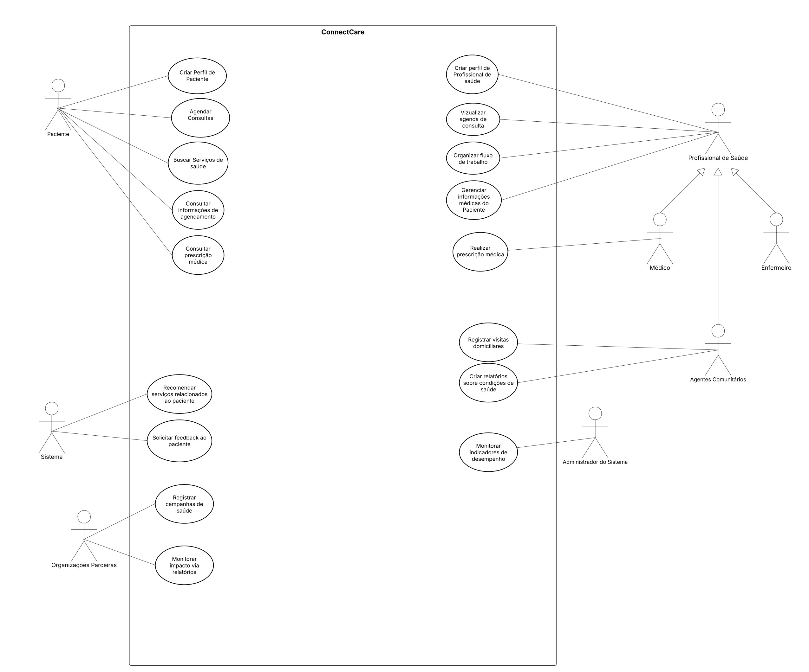

# Estudo de Caso - Diagrama de Casos de Uso

## Contexto do Estudo de Caso

O **ConnectCare** é um sistema de gerenciamento de saúde que permite a integração entre pacientes, profissionais de saúde e prestadores de serviço. O estudo de caso apresenta um exemplo prático de como modelar casos de uso em um cenário real de saúde conectada.

### Objetivo

Este estudo de caso demonstra as melhores práticas para construir diagramas de casos de uso, identificando:
- **Atores principais**: Pacientes, Médicos, Farmacêuticos e Administradores
- **Casos de uso**: Agendamento de consultas, prescrição de medicamentos, gestão de registros médicos
- **Relacionamentos**: Associações, inclusões e extensões entre casos de uso
- **Fronteiras do sistema**: O que está dentro e fora do escopo do sistema

### Diagrama de Referência

Abaixo está o diagrama de casos de uso do ConnectCare que serve como referência:

<a href="../../assets/ConnectCare.jpg" download class="download-btn" style="display: inline-block; background: linear-gradient(135deg, #0052cc 0%, #003d99 100%); color: white; padding: 10px 20px; border-radius: 6px; text-decoration: none; font-weight: bold; margin-top: 10px; transition: all 0.3s ease; box-shadow: 0 4px 12px rgba(0, 52, 204, 0.2);">📥 Download Caso de Uso</a>

---

### Especificação caso de Uso

Com base no diagrama de caso de uso apresentado acima, foram desenvolvidas seis especificações relacionadas:

#### 1. Criação de perfil de profissional

<iframe src="../../assets/caso_de_uso_perfil_paciente.pdf" width="100%" height="600px" style="border: none; border-radius: 8px; box-shadow: 0 2px 8px rgba(0,0,0,0.1); margin: 16px 0;"></iframe>

<a href="../../assets/caso_de_uso_perfil_paciente.pdf" target="_blank" style="display: inline-block; background: linear-gradient(135deg, #0052cc 0%, #003d99 100%); color: white; padding: 10px 20px; border-radius: 6px; text-decoration: none; font-weight: bold; margin: 10px 0; transition: all 0.3s ease; box-shadow: 0 2px 8px rgba(0, 52, 204, 0.2);">🔗 Abrir em Nova Aba</a>

---

#### 2. Criação de perfil de paciente

<iframe src="../../assets/caso_de_uso_perfil_profissional.pdf" width="100%" height="600px" style="border: none; border-radius: 8px; box-shadow: 0 2px 8px rgba(0,0,0,0.1); margin: 16px 0;"></iframe>

<a href="../../assets/caso_de_uso_perfil_profissional.pdf" target="_blank" style="display: inline-block; background: linear-gradient(135deg, #0052cc 0%, #003d99 100%); color: white; padding: 10px 20px; border-radius: 6px; text-decoration: none; font-weight: bold; margin: 10px 0; transition: all 0.3s ease; box-shadow: 0 2px 8px rgba(0, 52, 204, 0.2);">🔗 Abrir em Nova Aba</a>

---

#### 3. Gerenciamento das informações médicas do paciente

<iframe src="../../assets/Gerenciar_Informacoes.pdf" width="100%" height="600px" style="border: none; border-radius: 8px; box-shadow: 0 2px 8px rgba(0,0,0,0.1); margin: 16px 0;"></iframe>

<a href="../../assets/Gerenciar_Informacoes.pdf" target="_blank" style="display: inline-block; background: linear-gradient(135deg, #0052cc 0%, #003d99 100%); color: white; padding: 10px 20px; border-radius: 6px; text-decoration: none; font-weight: bold; margin: 10px 0; transition: all 0.3s ease; box-shadow: 0 2px 8px rgba(0, 52, 204, 0.2);">🔗 Abrir em Nova Aba</a>

---

#### 4. Registro de campanhas de saúde

<iframe src="../../assets/Registrar_campanhas_de_saude.pdf" width="100%" height="600px" style="border: none; border-radius: 8px; box-shadow: 0 2px 8px rgba(0,0,0,0.1); margin: 16px 0;"></iframe>

<a href="../../assets/Registrar_campanhas_de_saude.pdf" target="_blank" style="display: inline-block; background: linear-gradient(135deg, #0052cc 0%, #003d99 100%); color: white; padding: 10px 20px; border-radius: 6px; text-decoration: none; font-weight: bold; margin: 10px 0; transition: all 0.3s ease; box-shadow: 0 2px 8px rgba(0, 52, 204, 0.2);">🔗 Abrir em Nova Aba</a>

---

#### 5. Busca por serviços de saúde

<iframe src="../../assets/CasoDeUsoBuscarServicoDeSaude.pdf" width="100%" height="600px" style="border: none; border-radius: 8px; box-shadow: 0 2px 8px rgba(0,0,0,0.1); margin: 16px 0;"></iframe>

<a href="../../assets/CasoDeUsoBuscarServicoDeSaude.pdf" target="_blank" style="display: inline-block; background: linear-gradient(135deg, #0052cc 0%, #003d99 100%); color: white; padding: 10px 20px; border-radius: 6px; text-decoration: none; font-weight: bold; margin: 10px 0; transition: all 0.3s ease; box-shadow: 0 2px 8px rgba(0, 52, 204, 0.2);">🔗 Abrir em Nova Aba</a>

---

#### 6. Consulta de prescrição médica

<iframe src="../../assets/UC_Consultar_Prescricao_Medica.pdf" width="100%" height="600px" style="border: none; border-radius: 8px; box-shadow: 0 2px 8px rgba(0,0,0,0.1); margin: 16px 0;"></iframe>

<a href="../../assets/UC_Consultar_Prescricao_Medica.pdf" target="_blank" style="display: inline-block; background: linear-gradient(135deg, #0052cc 0%, #003d99 100%); color: white; padding: 10px 20px; border-radius: 6px; text-decoration: none; font-weight: bold; margin: 10px 0; transition: all 0.3s ease; box-shadow: 0 2px 8px rgba(0, 52, 204, 0.2);">🔗 Abrir em Nova Aba</a>

