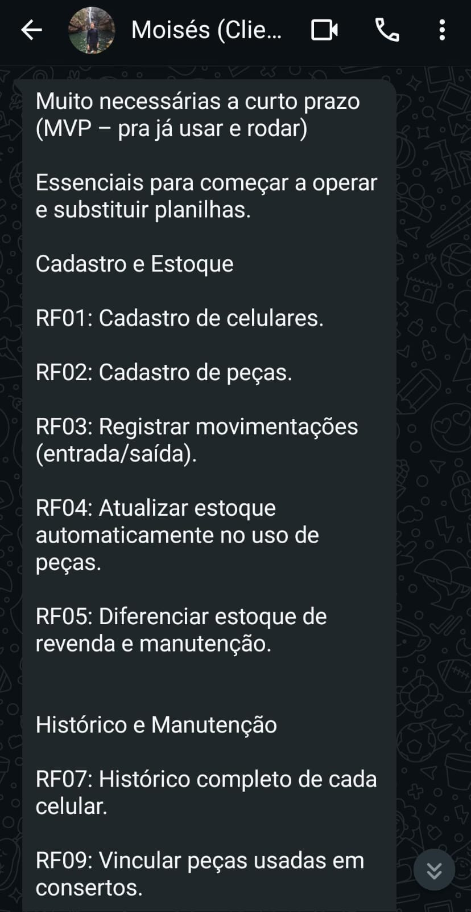
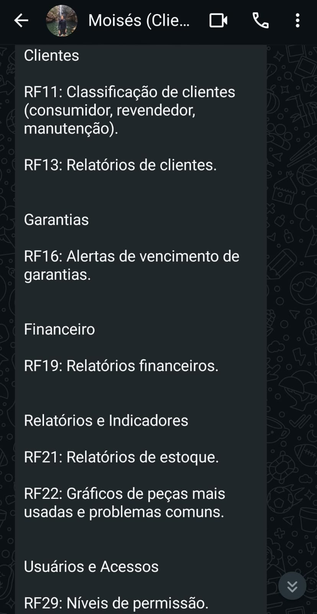
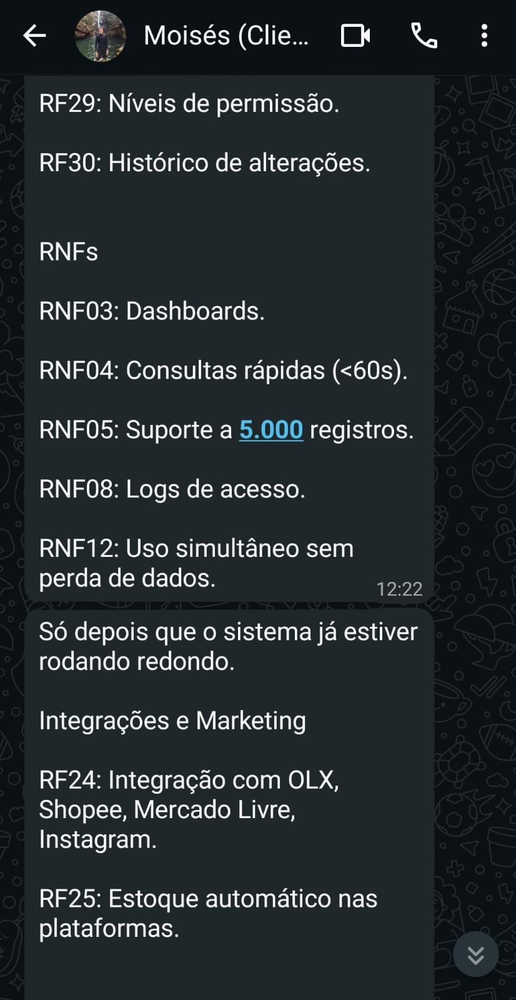
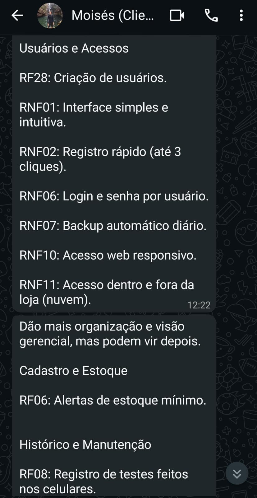

# Evidências

Esta seção contém todas as evidências do projeto, incluindo gravações de reuniões, apresentações, áudio e documentação de interações com o cliente.

---

## Priorização do MVP - Feedback do Cliente

Esta seção documenta a conversa com o cliente (Moisés) sobre a priorização e definição do MVP (Minimum Viable Product), realizada via mensagens de áudio e texto. O cliente destacou os requisitos essenciais para começar a operar e substituir as planilhas manuais.

### Requisitos Priorizados - Essenciais para MVP
O cliente enfatizou os requisitos essenciais para o MVP:

#### Evidências 1 
<button class="view-btn" onclick="openModal('modal1')">Ver Evidência</button>

  &times;
  

---

#### Evidências 2

<button class="view-btn" onclick="openModal('modal2')">Ver Evidência</button>

  &times;
  

---
#### Evidências 3

<button class="view-btn" onclick="openModal('modal3')">Ver Evidência</button>

  &times;
  

---

#### Evidências 4

<button class="view-btn" onclick="openModal('modal4')">Ver Evidência</button>

  &times;
  

---

#### Evidências 5

<button class="view-btn" onclick="openModal('modal5')">Ver Evidência</button>

  &times;
  

---

### Áudio - Priorização MVP

Gravação de áudio da conversa com o cliente sobre a priorização do MVP:

  <audio controls style="width: 100%;">
    <source src="../assets/Priorizacao-MVP.mp3" type="audio/mpeg">
    Seu navegador não suporta o elemento de áudio.
  </audio>

---

### Observação Importante do Cliente

*"Eu não adicionei a **____** de serviço como prioridade aí nas RFs porque eu não sei como vocês vão organizar Mas eu peço pra não esquecer por favor da das ordens de serviço ____ acabei me esquecendo na na reunião de falar pra vocês na na primeira reunião que a gente teve Mas as ordens de serviço são muito importantes mesmo"*

**Ação**: Incluir **Ordens de Serviço** como alta prioridade no MVP, pois é fundamental para a operação da CELLVEX.

---

## Reunião de Elicitação e Descoberta

Documentação da reunião de elicitação e descoberta de requisitos, onde foram identificadas as necessidades iniciais do cliente e o contexto do negócio.

### Roteiro da Reunião

Documento com o roteiro estruturado utilizado para guiar a reunião de elicitação:

<iframe src="../../assets/Roteiro.pdf" width="100%" height="600px" style="border: none; border-radius: 8px; box-shadow: 0 2px 8px rgba(0,0,0,0.1); margin: 16px 0;"></iframe>

<a href="../../assets/Roteiro.pdf" target="_blank" style="display: inline-block; background: linear-gradient(135deg, #0052cc 0%, #003d99 100%); color: white; padding: 10px 20px; border-radius: 6px; text-decoration: none; font-weight: bold; margin: 10px 0; transition: all 0.3s ease; box-shadow: 0 2px 8px rgba(0, 52, 204, 0.2);">🔗 Abrir em Nova Aba</a>
---

### Gravação da Reunião

Registro em vídeo completo da reunião de elicitação e descoberta:

  <iframe width="700" height="400"
    src="https://www.youtube.com/embed/zhKQkZeraZg"
    title="Reunião de Elicitação e Descoberta" frameborder="0"
    allow="accelerometer; autoplay; clipboard-write; encrypted-media; gyroscope; picture-in-picture"
    allowfullscreen
    style="border-radius: 12px; box-shadow: 0px 4px 15px rgba(0,0,0,0.2);">
  </iframe>

---

## Reunião de Validação - Sprint 7

Documentação da reunião de validação final com o cliente, realizada até a Sprint 7, onde foram apresentados os resultados e validadas as soluções implementadas.

  <iframe width="700" height="400"
    src="https://www.youtube.com/embed/jevg5aEGIj4"
    title="Reunião de Validação - Sprint 7" frameborder="0"
    allow="accelerometer; autoplay; clipboard-write; encrypted-media; gyroscope; picture-in-picture"
    allowfullscreen
    style="border-radius: 12px; box-shadow: 0px 4px 15px rgba(0,0,0,0.2);">
  </iframe>

---

## Reunião de Validação MVP

Validação do Minimum Viable Product com o cliente, apresentando as funcionalidades implementadas e coletando feedback sobre o MVP.

  <iframe width="700" height="400"
    src="https://www.youtube.com/embed/FrhUj0PKlWg"
    title="Reunião de Validação MVP" frameborder="0"
    allow="accelerometer; autoplay; clipboard-write; encrypted-media; gyroscope; picture-in-picture"
    allowfullscreen
    style="border-radius: 12px; box-shadow: 0px 4px 15px rgba(0,0,0,0.2);">
  </iframe>

---

## Reunião de RF e RNF

Reunião de discussão e alinhamento dos Requisitos Funcionais (RF) e Requisitos Não-Funcionais (RNF) do projeto.

### Documento de Requisitos

Lista completa de RF e RNF documentados:

<iframe src="../../assets/RF-RNF.pdf" width="100%" height="600px" style="border: none; border-radius: 8px; box-shadow: 0 2px 8px rgba(0,0,0,0.1); margin: 16px 0;"></iframe>

<a href="../../assets/RF-RNF.pdf" target="_blank" style="display: inline-block; background: linear-gradient(135deg, #0052cc 0%, #003d99 100%); color: white; padding: 10px 20px; border-radius: 6px; text-decoration: none; font-weight: bold; margin: 10px 0; transition: all 0.3s ease; box-shadow: 0 2px 8px rgba(0, 52, 204, 0.2);">🔗 Abrir em Nova Aba</a>

---

### Gravação da Reunião

Registro em vídeo da reunião de RF e RNF:

  <iframe width="700" height="400"
    src="https://www.youtube.com/embed/xF59l0Qzyk4"
    title="Reunião de RF e RNF" frameborder="0"
    allow="accelerometer; autoplay; clipboard-write; encrypted-media; gyroscope; picture-in-picture"
    allowfullscreen
    style="border-radius: 12px; box-shadow: 0px 4px 15px rgba(0,0,0,0.2);">
  </iframe>

---

## Validação de Protótipo de Baixo Nível

Validação com o cliente das telas de protótipo de baixo nível, coletando feedback e ajustes necessários.

### Áudio - Validação Protótipo de Baixo Nível

Gravação de áudio da conversa sobre a validação do protótipo de baixo nível:

  <audio controls style="width: 100%;">
    <source src="../assets/validacao.mp3" type="audio/mpeg">
    Seu navegador não suporta o elemento de áudio.
  </audio>

---

### Evidência Visual
Print da conversa sobre a validação do protótipo de baixo nível:

  <button class="view-btn" onclick="openModal('modal-proto-baixo')"> Clique para ver evidência</button>

  <button class="modal-close" onclick="closeModal('modal-proto-baixo')">&times;</button>
  

---

## Validação de Protótipo de Alto Nível

Validação com o cliente das telas de protótipo de alto nível, apresentando designs mais refinados e coletando aprovações finais.

Parte 1 

  <button class="view-btn" onclick="openModal('modal-proto-alto-1')"> Clique para ver evidência</button>

  <button class="modal-close" onclick="closeModal('modal-proto-alto-1')">&times;</button>
  

---
Parte 2

  <button class="view-btn" onclick="openModal('modal-proto-alto-2')"> Clique para ver evidência</button>

  <button class="modal-close" onclick="closeModal('modal-proto-alto-2')">&times;</button>
  

