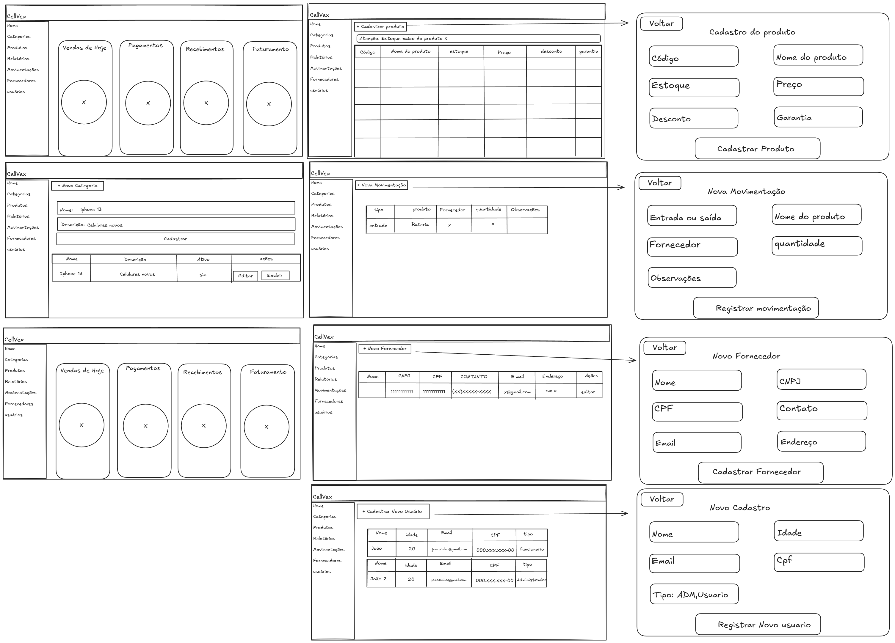

# Protótipos

## Protótipos Desenvolvidos

### Protótipo de Baixa Fidelidade

Os primeiros rascunhos foram elaborados utilizando o **Scalidraw**, ferramenta de desenho livre colaborativo. Esses protótipos de baixa fidelidade serviram como base para:

Mapear fluxos de telas e interações principais
Validar a estrutura geral com a cliente antes do investimento em UI
Gerar discussões rápidas em reuniões internas e externas

Figura 3 – Protótipo de Baixa Fidelidade.

### Protótipos de Alta Fidelidade – Figma

Após a validação dos rascunhos iniciais, a equipe produziu protótipos de alta fidelidade utilizando o Figma, com base nos componentes reais que serão utilizados na aplicação. Esses protótipos incluem:

- Tela de login
- Tela de cadastro de clientes
- Tela de novo cliente
- Tela de Cadastro de Peças
- Tela de nova peças
- Tela de ordem de serviço
- Tela de nova ordem de serviço

Algumas telas:

### Tela de login

Figura 4 – Login no Sistema.

### Tela de Dashboard

Figura 5 – Tela de Dashboard.

### Tela - Cadastro de clientes

Figura 6 – Tela Cadastro de Clientes.

### Tela - Cadastro de celulares

Figura 7 – Tela Cadastro de Celulares.

### Tela - Cadastro de peças

Figura 8 – Tela Cadastro de Peças.

### Tela - Nova peças
.png)

Figura 9 – Tela nova peça.

### Tela - Novo cliente
.png)

Figura 10 – Tela novo cliente.

### Tela - Novo celular
.png)

Figura 11 – Tela novo celular.

