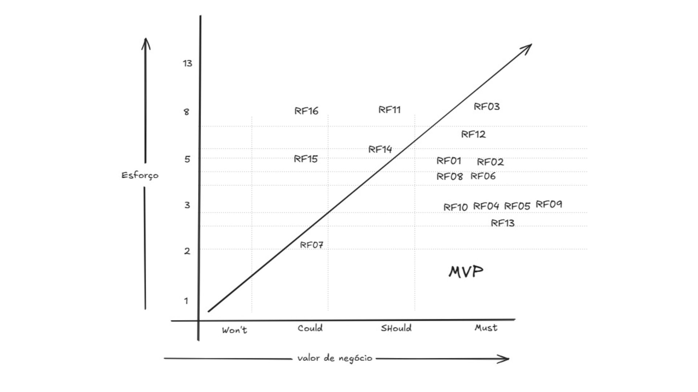

# 9 Backlog do Produto

## 9.1 Backlog Geral

### User Stories

**US01 – Cadastrar Celulares (RF01):** Como Administrador, eu quero cadastrar as informações dos celulares (modelo, IMEI, cor, capacidade, estado, valor de compra, garantia e defeitos identificados) e peças (nome, código interno, compatibilidade, quantidade, fornecedor) para ter um controle mais prático dos itens no estoque da loja.

**Critérios de aceitação:**

- [ ] Permitir cadastrar um novo celular com os campos: modelo, IMEI (único), cor, capacidade, estado, valor de compra, garantia e defeitos identificados. 
- [ ] Validar campos obrigatórios e exibir mensagem de erro quando houver dados ausentes ou duplicados (ex.: IMEI ou código interno). 
- [ ] Permitir editar e excluir registros de celulares e peças. 
- [ ] Registrar automaticamente a data, hora e o usuário responsável pelo cadastro ou alteração. 
- [ ] Exibir uma listagem de celulares com opções de busca e filtros (por modelo, código interno, fornecedor, estado, etc.). 
- [ ] Armazenar os dados de forma segura e integrá-los ao módulo de controle de estoque.

**US02 – Cadastrar Peças (RF2):** Como Administrador, eu quero cadastrar as informacoes das pecas de reposição (nome, código interno, garantia, compatibilidade, quantia e fornecedor) para manter o estoque preciso e organizado dos itens disponíveis para manutenção e venda.

**Critérios de aceitação:**

- [ ] Permitir cadastrar uma nova peça com os campos obrigatórios: nome, código interno (único), garantia, compatibilidade, quantidade e fornecedor. 
- [ ] Validar campos obrigatórios e exibir uma mensagem de erro clara quando houver dados ausentes. 
- [ ] Exibir uma mensagem de erro caso o código interno já esteja cadastrado (duplicidade). 
- [ ] Permitir editar as informações de uma peça existente. 
- [ ] Permitir excluir o registro de uma peça, mediante confirmação. 
- [ ] Exibir uma listagem de peças com opções de busca e filtros (por nome, código interno, fornecedor, compatibilidade, entre outros). 
- [ ] O campo "quantidade" deve ser inicializado e deve refletir a quantidade inicial da peça em estoque. 
- [ ] O campo "garantia" deve permitir a configuração do prazo. 

**US03 – Registrar ordem de serviço de reparo (RF3):** Como técnico, quero criar ordens de serviço vinculadas a um cliente e a um celular, para controlar os reparos realizados e suas garantias. 

**Critérios de aceitação:**

- [ ] Permitir criar uma nova OS vinculada a um cliente e a um celular. 
- [ ] A OS deve ser criada com status inicial "Em andamento". 
- [ ] Permitir atualizar o status para "Concluído" e registrar a data de conclusão. 
- [ ] Permitir registrar a garantia do serviço ao concluir o reparo. 
- [ ] O sistema deve adicionar automaticamente o evento ao histórico do celular.

**US03.1 - Registrar testes técnicos (RF3):** Como técnico de manutenção, quero registrar os testes realizados quando o celular é recebido para conserto, para documentar o estado do aparelho e evitar que o cliente alegue posteriormente que causamos defeitos que já existiam.

**Critérios de aceitação:**

- [ ] Ao criar uma nova OS, o sistema deve permitir registrar os testes e inspeções iniciais (ex.: câmera, tela, áudio, microfone, botões, conectores).
- [ ] Deve ser possível indicar o resultado de cada teste (aprovado, reprovado, não testado) e adicionar observações.
- [ ] O registro dos testes deve ser obrigatório antes de iniciar qualquer reparo.
- [ ] As informações dos testes devem ficar vinculadas à OS e ao histórico do celular.
- [ ] O sistema deve permitir anexar fotos ou vídeos do estado inicial do aparelho.
- [ ] O histórico de testes deve poder ser consultado posteriormente.

**US03.2 - Registrar peças utilizadas em reparos (RF3):** Como técnico, quero vincular as peças utilizadas durante um reparo, para que o sistema atualize automaticamente o estoque e registre os componentes aplicados no histórico do celular.

**Critérios de aceitação:**

- [ ] Permitir selecionar peças do estoque e vincular à OS com quantidade utilizada.
- [ ] O sistema deve descontar automaticamente as peças do estoque.
- [ ] Exibir alerta caso a quantidade selecionada seja maior que o disponível em estoque.
- [ ] Registrar no histórico do celular as peças utilizadas no reparo.

**US04 – Registrar Movimentações de Estoque (RF04):** Como Administrador, eu quero registrar em tempo real a movimentação dos itens que entram e saem do estoque da loja (compra, venda, devolução, conserto) para ter uma visão mais acessível dessas informações. Assim facilitando a minha comunicação com o cliente em momentos chave.

**Critérios de aceitação:**

- [ ] Permitir registrar movimentações de entrada e saída de produtos (celulares e peças).
- [ ] Cada movimentação deve conter: tipo de operação (compra, venda, devolução, conserto), item, quantidade, data/hora.
- [ ] O estoque deve ser atualizado automaticamente em tempo real após cada movimentação.
- [ ] Exibir alerta de erro quando a quantidade de saída for maior do que o disponível em estoque.
- [ ] Exibir mensagem de confirmação quando a movimentação for concluída com sucesso.
- [ ] Registrar automaticamente data, hora e usuário que realizou a movimentação.
- [ ] Manter histórico detalhado de todas as movimentações (data, tipo, quantidade, responsável).
- [ ] Permitir filtrar o histórico por tipo de operação, data ou usuário.
- [ ] Diferenciar movimentações de celulares e peças.
- [ ] Entradas de compras devem somar ao estoque.
- [ ] Devoluções devem repor o item no estoque.
- [ ] Exibir saldo atualizado de cada item na tela de controle de estoque.
- [ ] Exibir o status atual do item (em estoque, em conserto, vendido, devolvido).

**US05 – Diferenciar estoque de celulares (RF05):** Como Administrador, quero que o sistema mostre os celulares que estão para revenda e outros para manutenção no estoque.

**Critérios de aceitação:**

- [ ] Permitir vincular o celular ao tipo (se está para revenda ou para manutenção).
- [ ] Permitir filtrar o estoque por tipo (revenda ou manutenção).

**US06 – Manter Histórico de celulares (RF06):** Como Administrador, quero poder registrar todo o ciclo do celular, desde a entrada, as peças utilizadas, a venda e o cliente que comprou.

**Critérios de aceitação:**

- [ ] Permitir registrar a data de entrada do celular.
- [ ] Permitir vincular as peças utilizadas no aparelho.
- [ ] Permitir registrar a data de venda.
- [ ] Permitir vincular o cliente que comprou o celular.

**US07 – Vincular Peças Utilizadas (RF07):** Como Administrador gostaria de vincular as peças utilizadas em cada reparo ao histórico do celular, mantendo assim o registro completo das manutenções e facilitar o controle de estoque e as garantias.

**Critérios de aceitação:**

- [ ] O sistema deve permitir associar uma ou mais peças a um conserto registrado no sistema.
- [ ] A peça vinculada deve ter informações como nome, código, quantidade e data de uso.
- [ ] Ao vincular uma peça, o sistema deve atualizar o estoque, reduzindo a quantidade disponível de peças.
- [ ] O sistema deve impedir o vínculo de peças que não existam no cadastro ou que estejam com estoque zerado.

**US08 - Cadastrar Clientes (RF08 e RF09):** Como Administrador eu quero cadastrar os clientes por meio de nome, contato, CPF, histórico de compras/consertos e tipo (consumidores finais, revendedores e clientes de manutenção). Assim, posso ter uma visão mais organizada e centralizada sobre os clientes que já frequentaram a loja.

**Critérios de aceitação:**

- [ ] Permitir cadastrar um novo cliente com os campos: contato, CPF, histórico de compras/consertos e tipo (consumidores finais, revendedores e clientes de manutenção).
- [ ] Validar campos obrigatórios e exibir mensagem de erro quando houver dados ausentes ou duplicados (ex.: CPF).
- [ ] Permitir editar e excluir registros de clientes.
- [ ] Exibir uma listagem de clientes com opções de busca e filtros (por CPF, consertos e tipo).
- [ ] Armazenar os dados de forma segura.

**US09 - Consultar histórico por cliente (RF10):** Como Administrador, quero visualizar automaticamente os celulares comprados, ou com reparo realizado por cada cliente.

**Critérios de aceitação:**

- [ ] Listar os celulares comprados ou reparados.
- [ ] Permitir filtrar os celulares por tipo (comprados ou com reparos realizados) ou por cliente.

**US10 - Gerar relatórios de clientes (RF11):** Como Administrador, gostaria de visualizar relatórios que mostrem os clientes mais ativos, com garantias ativas e inadimplentes com os prazos. Me auxiliando no gerenciamento das vendas, garantias e clientes.

**Critérios de aceitação:**

- [ ] Gerar relatórios com as informações dos pontos relevantes sobre os clientes e garantias.
- [ ] O sistema deve gerar um relatório com os nomes e contatos dos clientes mais ativos nos últimos (30, 60, 90 dias ou customizados).
- [ ] O sistema deve gerar um relatório com as informações dos clientes com garantias ainda ativas.
- [ ] O sistema deve gerar um relatório com as informações dos clientes que não cumpriram com um prazo X.

**US11 - Gerenciar garantias (RF12):** Como Administrador, eu quero registrar e gerenciar as garantias dos produtos (celulares e serviços) definindo prazos específicos e recebendo alertas automáticos de vencimento, para manter a conformidade do serviço e fidelizar o cliente.

**Critérios de aceitação:**

- [ ] O sistema deve permitir o registro de garantias vinculadas ao celular e ao cliente.
- [ ] O registro deve permitir a configuração do prazo da garantia, suportando:
  - [ ] 90 dias como prazo padrão para serviços de conserto/reparo.
  - [ ] 1 ano para celulares novos ou revenda.
- [ ] O sistema deve calcular e registrar automaticamente a data de vencimento da garantia.
- [ ] O sistema deve ser capaz de emitir mensagens de alertas próximo ao vencimento da garantia (2 meses antes do vencimento).
- [ ] A informação da garantia (prazo e status) deve ser visível no histórico do celular e do cliente.
- [ ] O sistema deve permitir a consulta de status da garantia (ativa, vencida, próxima do vencimento).

**US12 - Registrar vendas (RF13):** Como Administrador, quero registrar as informações de uma venda realizada. Vinculando as informações do cliente (nome e contato), modelo do dispositivo, data de venda e a garantia do produto.

**Critérios de aceitação:**

- [ ] Registrar informações sobre a venda (data e comprador).
- [ ] Vincular informações do comprador (nome e contato) a venda.
- [ ] Vincular informações do dispositivo vendido (modelo e garantia).

**US13 – Registrar movimentações financeiras (RF14):** Como Administrador, gostaria de registrar as entradas e saídas financeiras vinculadas as vendas e serviços realizados. Além de permitir o registro de formas de pagamento como PIX, cartão e boleto.

**Critérios de aceitação:**

- [ ] O sistema deve permitir o registro de todas as entradas financeiras provenientes de vendas e serviços.
- [ ] O sistema deve permitir o registro de todas as saídas financeiras vinculadas a vendas e serviços.
- [ ] Ao registrar uma movimentação (Entrada ou Saída), o sistema deve exigir a vinculação a uma venda ou serviço.
- [ ] O sistema deve permitir a seleção e registro das seguintes formas de pagamento para entradas: Pix, cartão e boleto.
- [ ] Cada registro de movimentação deve incluir o valor, a data, a forma de pagamento e a descrição (venda/serviço/associado).
- [ ] O sistema deve armazenar essas movimentações para que possam ser utilizadas na geração de relatórios de faturamento e lucro.

**US14 – Gerar relatórios de estoque (RF15):** Como Administrador, gostaria de visualizar relatórios com informações relevantes do estoque. Como os produtos disponíveis, estoque mínimo e produtos parados. Para ter uma visão mais ampla da situação do estoque da loja.

**Critérios de aceitação:**

- [ ] O sistema deve ter uma funcionalidade dedicada para Gerar Relatórios de Estoque.
- [ ] Deve ser possível gerar um relatório que liste todos os produtos disponíveis (celulares e peças).
- [ ] O sistema deve gerar um relatório específico para itens que atingirem ou estão abaixo do estoque mínimo.
- [ ] O sistema deve gerar um relatório de Produtos parados (itens que não tiveram movimentação de saída, como venda ou uso em conserto, em um período específico).
- [ ] Os relatórios devem incluir informações como: Nome/Modelo do item, quantidade atual, localização no estoque e data da última movimentação.
- [ ] Os dados de cada relatório devem ser apresentados em uma lista que suporte a exportação em formato (PDF ou CSV).

**US15 – Gerar gráficos de Manutenção (RF16):** Como Administrador, gostaria de visualizar gráficos que mostrem as peças mais utilizadas em consertos, com maior recorrência de uso e celulares que mais apresentam problemas. Me auxiliando na manutenção do estoque e plano de manutenção.

**Critérios de aceitação:**

- [ ] Gerar uma representação visual dos dados relevantes em formato de gráfico de pizza.
- [ ] O sistema deve gerar um gráfico das peças mais utilizadas em consertos (em volume total) dentro de um período selecionável (últimos 30, 60, 90 dias ou customizados).
- [ ] O sistema deve gerar um gráfico que identifique os Modelos de Celular com Maior Recorrência de Problemas/Consertos (em número de Ordens de Serviço abertas) dentro de um período selecionável.
- [ ] O gráfico de peças deve permitir que o Administrador visualize a frequência de uso da peça, auxiliando na manutenção do estoque.
- [ ] O gráfico de celulares deve auxiliar no plano de manutenção, destacando os modelos que mais demandam atenção.
- [ ] O sistema deve exibir os gráficos em um dashboard ou tela de relatórios gerenciais de forma resumida e intuitiva.

## 9.2 Priorização do Backlog Geral 

A priorização apresentada foi revisada com base na complexidade estimada e no valor de negócio de cada requisito. Para estimar a complexidade, utilizamos Story Points, seguindo a sequência de Fibonacci (1, 2, 3, 5, 8, 13...), levando em consideração fatores como esforço técnico, grau de incerteza e impacto funcional. 

O valor de negócio foi avaliado em conjunto com o cliente por meio da técnica de priorização MoSCoW (Must have, Should have, Could have, Won’t have), permitindo identificar os requisitos de maior relevância para o negócio. 

- **Must have::** Requisitos essenciais, indispensáveis para o funcionamento mínimo do produto. Sua entrega é obrigatória, pois, sem eles, o sistema não atende aos requisitos básicos de uso ou de negócio. 

- **Should have:** Requisitos importantes, que agregam valor significativo ao produto, mas que podem ser implementados após os itens críticos. Embora não sejam vitais para o funcionamento imediato, sua ausência pode impactar a experiência do usuário ou a eficiência do sistema. 

- **Could have:** Requisitos desejáveis, que aumentam a atratividade ou conveniência do produto, mas que não são essenciais no escopo inicial. Podem ser considerados em futuras versões, caso haja tempo ou recursos disponíveis. 

- **Won’t have:** Requisitos ou melhorias que não serão implementados nesta versão do produto. São itens identificados como desejáveis ou interessantes, mas que, após análise com o cliente e a equipe, foram considerados fora do escopo atual devido a restrições de tempo, orçamento, tecnologia ou alinhamento estratégico. 

## 9.3 MVP

A definição do **Produto Mínimo Viável (MVP)** foi realizada com base na análise da relação entre o valor de negócio e o esforço de implementação de cada requisito, conforme representado na matriz de priorização. Assim, foram priorizados os requisitos localizados na região de **alto valor e complexidade viável**, por representarem **funcionalidades essenciais e de maior impacto para o cliente**. Requisitos com alto esforço de desenvolvimento e baixo valor agregado foram excluídos do escopo do MVP, de modo a concentrar o desenvolvimento em entregas que proporcionem maior retorno em menor tempo, garantindo uma primeira versão **funcional, estratégica e alinhada às necessidades prioritárias da loja "CELLVEX"**. 
 
A seguir, apresenta-se a matriz de esforço e impacto, que relaciona os requisitos conforme o valor de negócio e o esforço de implementação, servindo de base para a definição do MVP:

Figura 2 – Matriz de esforço e impacto.

## 9.4 Avaliação Técnica (Esforço)

### Esforço

#### Descrição do Esforço para o Desenvolvimento

| Esforço | Descrição |
|---------|-----------|
| Pouco esforço (1) | 1 dia de desenvolvimento |
| Pouco esforço (2) | 1 dia e meio de desenvolvimento |
| Pouco esforço (3) | 2 dias de desenvolvimento |
| Médio esforço (5) | 3 dias de desenvolvimento |
| Médio esforço (8) | 4 dias de desenvolvimento |
| Alto esforço (13) | 1 semana de desenvolvimento |

Portanto, a tabela a seguir relaciona os requisitos funcionais, suas histórias de usuário, objetivos específicos, prioridade (MoSCoW), esforço estimado (Story Points) e a inclusão dos itens que compõem o MVP.

### Objetivos Específicos (OE)

| Código | Descrição |
|--------|-----------|
| OE1 | Otimização e organização do controle de entrada e saída dos produtos vendidos. |
| OE2 | Melhorar a visualização do estoque físico e da disponibilidade dos produtos. |
| OE3 | Permitir uma visualização concreta dos nomes, contatos, modelos de celulares e histórico de compras dos clientes. |
| OE4 | Oferecer garantia dos produtos vendidos. |
| OE5 | Aprimorar a tomada de decisão por meio da disponibilização de informações gerenciais sobre fluxo de produtos, vendas e lucro. |
| OE6 | Controle de trocas e registros de peças trocadas. |

### Tabela de Backlog com Priorização

| Código RF | US | OE | Prioridade (MoSCoW) | Story Points (Esforço) | MVP |
|-----------|----|----|---------------------|------------------------|-----|
| RF 01 | US01 | OE1 | Must | 5 | x |
| RF 02 | US02 | OE1 | Must | 5 | x |
| RF 03 | US3, US3.1, US3.2, US3.3 | OE2 | Must | 8 | x |
| RF 04 | US04 | OE1 | Must | 3 | x |
| RF 05 | US05 | OE2 | Must | 3 | x |
| RF 06 | US06 | OE3 | Must | 5 | x |
| RF 07 | US07 | OE6 | Could | 2 | x |
| RF 08 | US08 | OE3 | Must | 5 | x |
| RF 09 | US08 | OE3 | Must | 3 | x |
| RF 10 | US09 | OE3 | Must | 3 | x |
| RF 11 | US10 | OE5 | Should | 8 |  |
| RF 12 | US11 | OE4 | Must | 5 | x |
| RF 13 | US12 | OE3 | Must | 3 | x |
| RF 14 | US13 | OE1 | Should | 5 |  |
| RF 15 | US14 | OE5 | Could | 5 |  |
| RF 16 | US15 | OE5 | Could | 8 |  |

