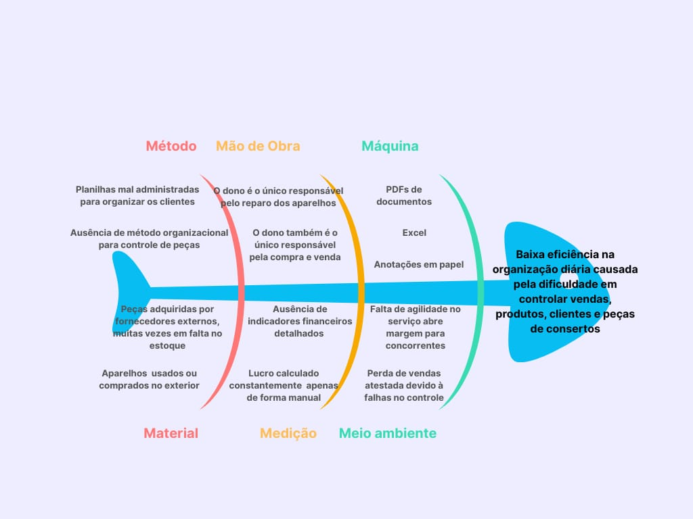

# VISÃO DO PRODUTO E PROJETO 

## 1.1 Introdução ao Negócio e Contexto

O mercado de celulares no Brasil, especialmente o de iPhones e smartphones premium, é altamente competitivo e dinâmico, movimentado tanto por consumidores finais quanto por revendedores e assistências técnicas. A crescente dependência das pessoas por dispositivos móveis e a rápida obsolescência tecnológica alimentam uma demanda constante por reparos, trocas de peças e aquisição de novos aparelhos.  

É nesse cenário que se insere a loja de Moisés **“CELLVEX”**, um pequeno negócio localizado na região do Novo Gama – GO, especializado na compra, venda e manutenção de celulares, com foco em iPhones. O modelo de atuação envolve múltiplas facetas: aquisição de aparelhos com defeito para reparo e revenda, importação de dispositivos, negociação direta com clientes e realização de manutenções gerais em smartphones. 

Apesar da consolidação da loja como referência local em compra, venda e manutenção de celulares, sua forma de gestão ainda é limitada por processos não automatizados e falta de integração entre controles. Essa fragilidade operacional representa um ponto crítico para a expansão do negócio, pois em um mercado cada vez mais digitalizado e competitivo, a falta de organização tecnológica reduz a confiabilidade das informações e limita a capacidade de crescimento sustentável. 

## 1.2 Identificação da Oportunidade ou Problema
A loja de Moisés experimenta uma demanda crescente e consistente, impulsionada pela sua reputação positiva e pela qualidade do serviço técnico. No entanto, à medida que o volume de operações aumenta, as fragilidades dos processos manuais tornam-se evidentes, limitando a capacidade de resposta e gerando pontos de falha críticos. 

Situações recorrentes impactam diretamente a operação e a experiência do cliente: a perda de vendas devido à falta de um controle de estoque preciso e em tempo real, a dificuldade em gerenciar e monitorar prazos de garantia de forma eficaz, e a incapacidade de gerar relatórios inteligentes, como identificar os modelos de celular que mais demandam determinadas peças, resultam em ineficiências operacionais e insatisfação. A desconexão entre os anúncios em plataformas como OLX e Instagram e o estoque real já gerou reclamações diretas dos clientes e a perda concretas de oportunidades de venda. 

Estes problemas são sintomas de causas profundas e inter-relacionadas. A operação depende fundamentalmente da intervenção humana para cada etapa, desde o registro inicial de um aparelho em listas físicas até o arquivamento de contratos de garantia em PDFs. A dependência de planilhas de Excel, ferramenta de difícil manipulação para o proprietário, introduz riscos de erro, duplicidade e perda de informação. A completa desconexão entre os registros financeiros, o controle de estoque e a gestão de serviços cria silos de informação que impossibilitam uma visão unificada do negócio. Essa fragmentação dos dados impede uma análise confiável do desempenho, tornando a gestão financeira uma tarefa árdua e baseada em dados potencialmente desatualizados ou imprecisos. 

O resultado é um ciclo de improdutividade e oportunidades perdidas: o tempo que poderia ser investido em atendimento, negociação e estratégia é consumido pela busca de informações e pela tentativa de manter controles inconsistentes. Esta fragilidade operacional não apenas restringe a capacidade de crescimento, mas também expõe o negócio a riscos financeiros e a uma desvantagem competitiva crônica em um mercado que exige agilidade e confiabilidade. 

Figura 1 – Diagrama de Ishikawa (Espinha de Peixe) do Projeto TECHSTOCK.

## 1.3 Desafios do Projeto

Hoje, o proprietário trabalha sozinho, o que torna a gestão das várias funções da loja ainda mais difícil. E por depender de planilhas em Excel para fazer o controle de estoque durante as vendas de aparelhos e peças, ele tem ainda mais dificuldades no uso da ferramenta, o que já chegou a afetar a eficiência de seu trabalho. Essa limitação já causou atrasos no registro de informações, além da perda de dados relevantes e até vendas por não conseguir fazer verificações rápidas do estoque. 

O controle atual também não permite acompanhar de maneira conveniente os celulares em manutenção, os destinados à revenda e os clientes atendidos. A falta de registros confiáveis sobre os itens mais vendidos ou clientes em débito impede que o proprietário possa agir rapidamente em momentos relevantes. Nessa situação, a organização da loja depende de anotações manuais e verificações demoradas de uma única pessoa. 

Assim como boa parte da organização da gestão da loja, atualmente, os registros de garantia são feitos de maneira manual, em documentos PDF armazenados localmente. Isso dificulta o acompanhamento de prazos, o que pode resultar em insatisfação dos clientes caso as informações sobre a venda sejam esquecidas. 

Apesar do peso que carrega sozinho atualmente, o proprietário já mostrou interesse que a loja cresça, e gostaria de trabalhar não apenas com a venda celulares e peças, mas também acessórios. Porém, o método de funcionamento atual não possibilita esse crescimento de forma prática, já que a organização manual se torna cada vez mais difícil à medida que a quantidade de dados aumenta. 

No geral, esses desafios mostram que, na situação atual, a operação da loja enfrenta limites em sua eficiência que dificultam a expansão e até funcionamento. 

## 1.4 Segmentação de Cliente

**Proprietário (20 anos):** Técnico em informática, empreendedor. Possui habilidades digitais, devido sua formação técnica. Busca otimizar seu tempo através de soluções tecnológicas. Tem por objetivo crescer no mercado de revenda e manutenção de celulares na região do Novo Gama – GO. 
